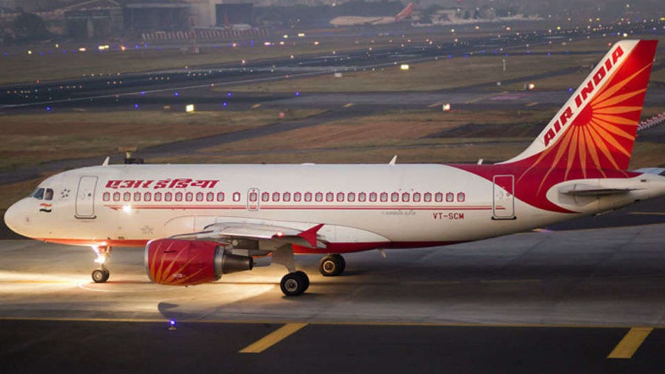

# Machine-Learning-for-Flight-Ticket-Pricing-DST-1
## Project Report

## DECLARATION

#### A project report on Machine-Learning-for-Flight-Ticket-Pricing project Successfully submitted By

*Active Team Members details are available in below link:*

https://docs.google.com/spreadsheets/d/1vHy8QH4HDF3_vx4foENfCvC8e1x4b0MyGaUgVGmqu2A/edit?usp=sharing

## Problem Statement
#### Can we use Machine Learning to help a customer decide the optimal time to purchase a flight ticket?

## ABSTRACT

Airlines employ complex, secretly-kept algorithms to vary flight ticket prices over time based on several factors,including seat availability,airline capacity, the price of oil, seasonality, etc. At any point in time, a customer looking to purchase a flight ticket has the option to buy or wait (in the hope of the flight price reducing in future).However, since they lack knowledge of these algorithms, customers often default to purchasing a ticket as early as possible rather than trying to optimize their time of purchase.However, vast quantities of data regarding flight ticket prices are available on the Internet. Through this project,we hoped to use this data to help customers make their decisions. We created an airline ticket-buying agent that tries to buy a customer’s flight ticket to optimize for price of purchase.We have selected  website to scrap the Indian flights data.

## Data
Below is the small sample of our dataset:

#### Data points --> 330939 rows
#### Dataset date range --> April 2021 to May 2021
#### Dataset Attributes:

Price - flight price

departure_time	- flight schedule time

arrival_time - arrival time of flight

Airline	Cabin - There are three type

E - Economy

PE - Premium Economy

B - Business

Dept_city - Departure city

Dept_date - Departure Date	

arrival_city - Arrival city	

stops - Number of stops

duration - Flight duration in minutes

weekday	dept_hours	

Dept_flights_time	

optimal_hours

### Machine Learning Framework:

Assume a customer decides to purchase a ticket for a particular flight at time = X 
hours before departure. The optimal time to purchase the ticket t0pt is:
- in the range [X hours before dep., 4 hours before dep.]
- time at which we achieve minimum flight price until departure

We have used `RandomForestRegressor` algorithm to predict first optimal time then to predict price whose architecture is as below:

##### Predict optimal time architecture

    Fitting 5 folds for each of 10 candidates, totalling 50 fits
    [Parallel(n_jobs=-1)]: Using backend LokyBackend with 2 concurrent workers.
    [Parallel(n_jobs=-1)]: Done  37 tasks      | elapsed: 15.4min
    [Parallel(n_jobs=-1)]: Done  50 out of  50 | elapsed: 19.7min finished
    RandomizedSearchCV(cv=5, error_score=nan,
                       estimator=RandomForestRegressor(bootstrap=True,
                                                       ccp_alpha=0.0,
                                                       criterion='mse',
                                                       max_depth=None,
                                                       max_features='auto',
                                                       max_leaf_nodes=None,
                                                       max_samples=None,
                                                       min_impurity_decrease=0.0,
                                                       min_impurity_split=None,
                                                       min_samples_leaf=1,
                                                       min_samples_split=2,
                                                       min_weight_fraction_leaf=0.0,
                                                       n_estimators=100,
                                                       n_jobs=None, oob_score=False,
                                                       random_state=None, verbose=0,
                                                       warm_start=False),
                       iid='deprecated', n_iter=10, n_jobs=-1,
                       param_distributions={'max_depth': [5, 10, 15, 20, 50],
                                            'min_samples_split': [2, 3, 5, 10]},
                       pre_dispatch='2*n_jobs', random_state=None, refit=True,
                       return_train_score=False, scoring=None, verbose=2)

Selected best_params_ after hyperparameter tunning : `{'min_samples_split': 5, 'max_depth': 20}`
 
 Accuracy = 0.9017739133612731

##### Predict price time architecture

    Fitting 5 folds for each of 10 candidates, totalling 50 fits
    [Parallel(n_jobs=-1)]: Using backend LokyBackend with 2 concurrent workers.
    [Parallel(n_jobs=-1)]: Done  37 tasks      | elapsed: 14.5min
    [Parallel(n_jobs=-1)]: Done  50 out of  50 | elapsed: 19.6min finished
    RandomizedSearchCV(cv=5, error_score=nan,
                       estimator=RandomForestRegressor(bootstrap=True,
                                                       ccp_alpha=0.0,
                                                       criterion='mse',
                                                       max_depth=None,
                                                       max_features='auto',
                                                       max_leaf_nodes=None,
                                                       max_samples=None,
                                                       min_impurity_decrease=0.0,
                                                       min_impurity_split=None,
                                                       min_samples_leaf=1,
                                                       min_samples_split=2,
                                                       min_weight_fraction_leaf=0.0,
                                                       n_estimators=100,
                                                       n_jobs=None, oob_score=False,
                                                       random_state=None, verbose=0,
                                                       warm_start=False),
                       iid='deprecated', n_iter=10, n_jobs=-1,
                       param_distributions={'max_depth': [5, 10, 15, 20, 50],
                                            'min_samples_split': [2, 3, 5, 10]},
                       pre_dispatch='2*n_jobs', random_state=None, refit=True,
                       return_train_score=False, scoring=None, verbose=2)
                       
Selected best_params_ after hyperparameter tunning : `{'min_samples_split': 5, 'max_depth': 20}`

Accuracy = 0.9351213338653643

## Final Model output on WebApp
## Using Flask Heroku Web App
Flask Code
Link :https://github.com/mak-rayate/Flask_ML_Flight_pred

Public URL : 

## Using Streamlit Heroku Web App

